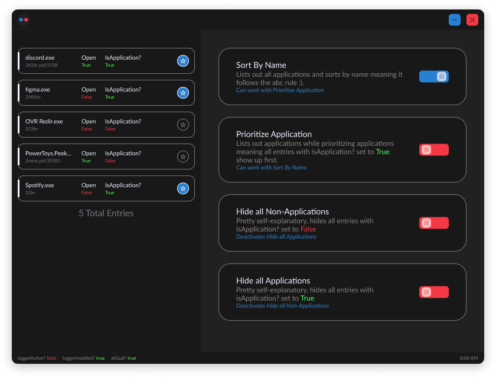

# EchoWhisperer (Main) v0.0.1 

### A up-to-date process logger for easy use and bragging rights for WINDOWS.
Echo Whisperer is a commandline/gui application that simply logs the amount 
of time you spend on a single application.
all processes are logged and you choose which ones can be favorited or are applications.



<div style="height:20px"></div>

# C++ 
> ###### *Compile Application for c++*
> ```bash
> cd "./c++" && "./compileListener.bat"
> ```
> ###### *Run "logger.exe"*
> ```bash
> ./logger.exe
> ```
"logger.exe" will soon be automatically placed in specific directories within the windows operating system, will also start on boot when needed.

<div style="height:20px"></div>

# Electron 
> ###### *Install required modules*
> ```console
> npm install
> ```
> ###### *Start the application*
> ```console
> npm run start
> ```
As of now, the application is barely developed. but will inlcude many things such as communication with the c++ program.
